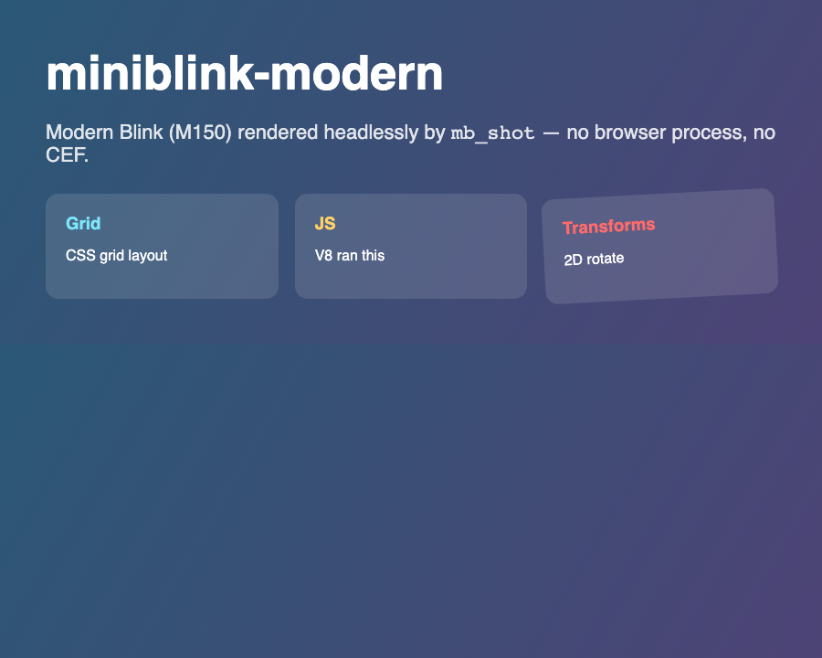
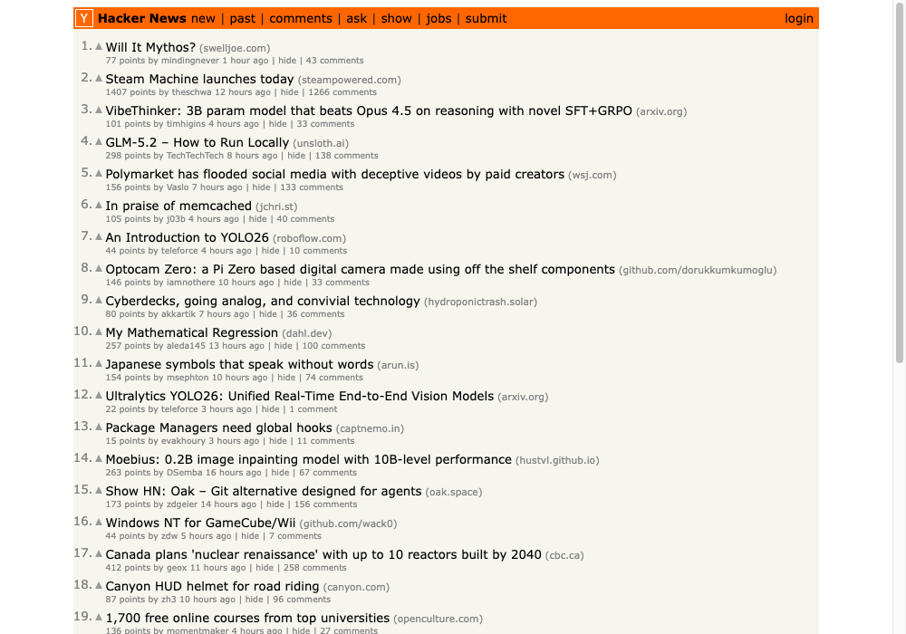
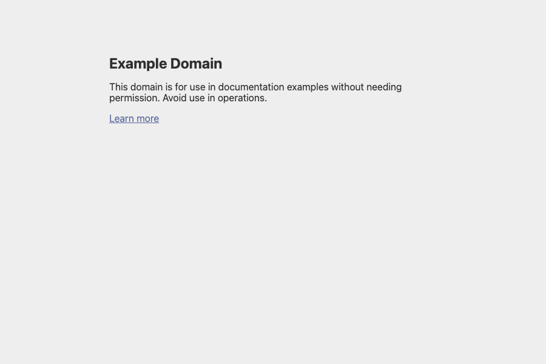
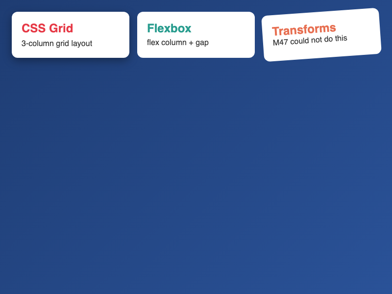
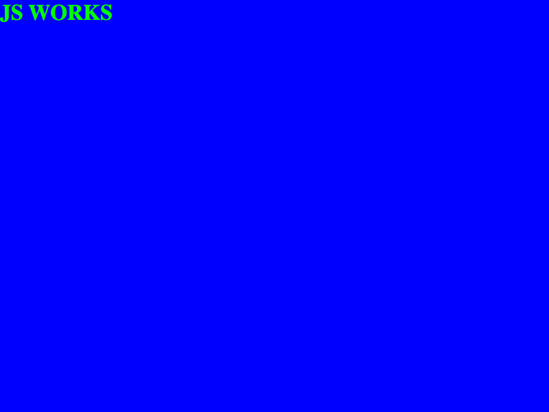
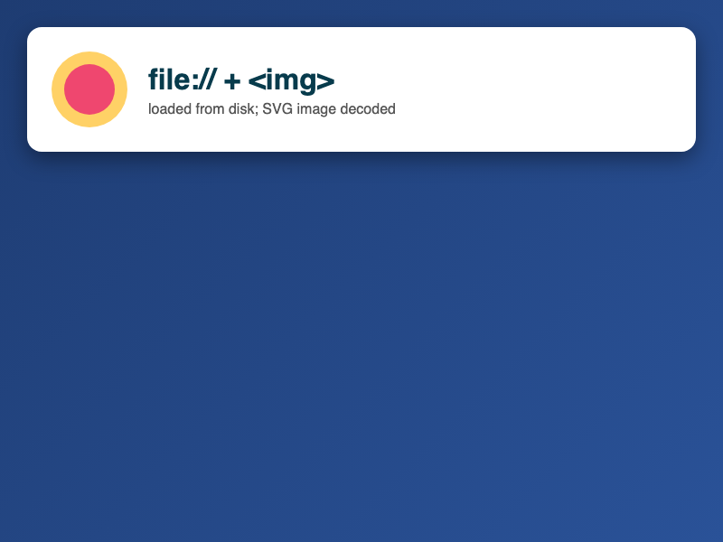
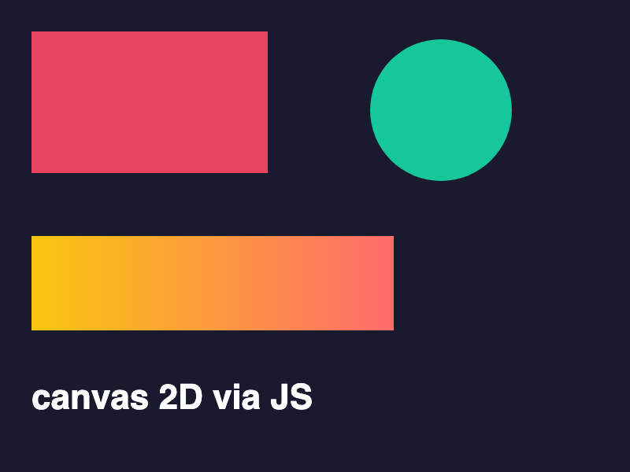

# miniblink-modern

A **standalone, single-process embedder of modern Blink** (Chromium M150 / V8 15) — a
hand-written tiny "content layer" that boots the real Blink engine in-process and renders
HTML/CSS/JavaScript to a bitmap through a small C ABI. **No CEF**, no separate browser
process, no Mojo IPC across processes.

It is the spiritual successor to [miniblink49](https://github.com/weolar/miniblink49)
(whose Blink froze at ~M47/2015), rebuilt against the M150 engine. The old miniblink
embedding model — call straight into `WebViewImpl` — no longer exists in modern Blink
(everything routes through Mojo + `//content`). This project provides the *minimum* host
that satisfies modern Blink so it runs without the full browser.

## What works today (all screenshot-verified)

| Subsystem | Status |
|---|---|
| Build modern Blink as GN libraries, link into a standalone host via a C ABI | ✅ |
| Engine boot in-process: V8 isolate + Oilpan/cppgc + main-thread scheduler | ✅ |
| WebView + main LocalFrame + (non-compositing) WebFrameWidget | ✅ |
| HTML parsing, UA stylesheet, CSS cascade | ✅ |
| Fonts + text (CoreText), real glyph rasterization | ✅ |
| **Modern CSS**: Grid, Flexbox+gap, gradients, border-radius, box-shadow, 2D transforms | ✅ |
| **JavaScript** (V8) + DOM mutation → style recalc → relayout → repaint | ✅ |
| `<canvas>` 2D drawing via JS (shapes, gradients, text → skia) | ✅ |
| `mbLoadURL("file://…")` — load a document from disk | ✅ |
| Image decode + SVG rendering (data: URIs **and external files**) | ✅ |
| **Subresource loading** (external `<link>` CSS, ``) via a `blink::URLLoader` | ✅ |
| In-process `MimeRegistry` (so `file://` stylesheets validate) | ✅ |
| **HTTP/HTTPS loading of live websites** via system libcurl | ✅ |
| Paint readback to a BGRA8888 bitmap + PNG; **PDF export** (paginated, via Blink print) | ✅ |
| Input events (click, move/hover, type, scroll), HiDPI, custom UA | ✅ |
| **DOM storage** (`localStorage` / `sessionStorage`, in-memory) | ✅ |
| `requestAnimationFrame` (serviced without a compositor) | ✅ |
| Observers: Mutation, **Intersection** (forced past offscreen throttling), Resize | ✅ |
| Web/CSS Animations advance (clock serviced); `XMLHttpRequest` + `fetch` | ✅ |
| Console capture (`console.log`/`warn`/`error` → host) | ✅ |
| Init scripts (`evaluateOnNewDocument`: run JS before page scripts) | ✅ |
| Isolated-world eval (content-script model: separate globals, shared DOM) | ✅ |
| **Cookies**: HTTP jar + JS `document.cookie`; JS-set cookies bridge to the HTTP jar | ✅ |
| Custom request headers + default `Accept-Language` | ✅ |
| On-screen window, GPU compositing, IndexedDB | ⏳ roadmap |

## Tool: `mb_shot` (headless HTML → PNG)

The deliverable example app — a standalone headless screenshot renderer:

```sh
mb_shot [--full] [--scale N] [--clip x,y,w,h | --selector CSS] [--transparent] \
        [--wait-selector CSS] [--wait-ms N] [--console] [--header "N: V"] [--text] [--html] [--no-images] [--dark] [--lang L,L2] [--tz Area/City] \
        <input.html | file://URL | http(s)://URL> <out.png> [width height]
```

`--full` captures the entire document height (the view is resized to the page's
`scrollHeight` before rendering, capped at 20000px), like Puppeteer's `fullPage` — e.g.
`mb_shot --full https://go.dev out.png` produces a 1200×3969 image of the whole page
instead of just the 1200×900 viewport.

`--scale N` renders at a device pixel ratio of N: the page lays out at `[width height]`
CSS px but `window.devicePixelRatio == N` and the PNG is `width*N × height*N` — retina-crisp
text and 2x `srcset`/`min-resolution` media-query selection. The flags compose, e.g.
`mb_shot --full --scale 2 https://go.dev out.png` → a 2400×7938 whole-page @2x capture.

`--clip x,y,w,h` captures only that logical rectangle; `--selector CSS` captures only the
bounding box of the first element matching the selector (an element screenshot) — e.g.
`mb_shot --selector "#card" page.html card.png` writes a PNG sized exactly to that element.
Clip/selector compose with `--scale` (the output is `w*N × h*N`).

`--transparent` captures with a transparent background (Puppeteer's `omitBackground`): areas
the page doesn't paint keep alpha 0, so the PNG can be composited over other content.

`--wait-selector CSS` waits (driving timers/async) until an element matching the selector
exists before capturing — for JS-rendered content (Puppeteer's `waitForSelector`); `--wait-ms
N` just settles the page for N ms. Both compose with the capture options.

`--console` prints the page's captured console output (`console.log`/`warn`/`error`) to
stderr — useful for debugging a page or scripting against its logs.

`--text` prints the page's visible text (post-JS `document.body.innerText`) to stdout, so
`mb_shot` doubles as a simple scraper/text extractor. `--html` prints the rendered
(post-JS) DOM as serialized HTML — useful for SPAs whose fetched source is near-empty.

`--no-images` disables network image loading (faster text/HTML scraping; inline `data:`
images are unaffected). `--dark` emulates `prefers-color-scheme: dark` so pages render their
dark theme. `--lang "fr-FR,fr,en"` sets `navigator.language(s)` for locale-aware pages, and
`--tz "America/New_York"` overrides the timezone for `Date`/`Intl`.

The output format follows the file extension: `.png` (lossless, alpha), `.jpg`/`.jpeg`
(quality 90, much smaller), or `.pdf` (a paginated US-Letter PDF via Blink's print path) —
e.g. `mb_shot https://example.com out.jpg` or `mb_shot article.html article.pdf`.

Rendered by `mb_shot` from an HTML file (gradient, CSS grid, translucent cards, a
rotated card, and JS-injected text — all modern Blink, headless, no CEF):



**Live websites over HTTPS**, fetched via system libcurl and rendered by modern Blink.
`mb_shot https://news.ycombinator.com out.png` — the real Hacker News front page, with its
external `news.css`, `hn.js`, and SVG/image subresources all loaded through the host:



`mb_shot https://example.com out.png`:



Verified rendering a sweep of diverse real sites (example.org, danluu, gnu.org, lite.cnn,
Hacker News, rust-lang, Wikipedia, MDN, w3.org, python.org — **10/10**), including
`fetch()`-heavy, web-font, and `<video>`-containing pages. A handful of minimal blink
compatibility shims for the non-compositing offscreen widget live in `patches/` (applied
by `build.sh`).

### Demos

Modern CSS (grid + flexbox + gradient + transform + shadow) — none of which M47 could render:



JavaScript mutating the DOM (bg→blue, text→"JS WORKS"):



`file://` load + inline SVG `` decode in a flex row:



`<canvas>` 2D drawn via JavaScript (rects, arc, linear gradient, text):



## Architecture

```
┌─ outer shell (CMake, this project) ─────────────────────┐
│  wke/mb public C API  +  port/<platform> host window    │  ← future
└──────────────────── links the C ABI ▼ ─────────────────┘
┌─ miniblink_host (GN target, src/miniblink_host) ────────┐
│  mb_capi      extern "C" ABI (the seam)                 │
│  mb_runtime   engine bring-up (V8 snapshot, ThreadPool, │
│               ResourceBundle, scheduler, blink::Initialize)
│  mb_platform  blink::Platform (locale, broker, resources)│
│  mb_view*     WebView::Create + CreateMainFrame handshake│
│  mb_widget    non-compositing frame widget               │
│  paint        GetPaintRecord().Playback → SkBitmap       │
├─────────────────────────────────────────────────────────┤
│  modern Blink + substrate (base, mojo, cc, skia, v8…)   │  built as-is by GN
└─────────────────────────────────────────────────────────┘
```

The **C ABI** dissolves the GN↔CMake build mismatch: GN builds everything that touches
Blink/base/mojo C++ types; the outer shell links only the pure-C `mb_capi.h`.

See `docs/interface-surface.md` for the exact minimal Blink embedding surface, and
`PROGRESS.md` for the full build journal (every fix, file:line-cited).

## Public C ABI (`src/miniblink_host/capi/mb_capi.h`)

```c
int   mbInitialize(void);                 // boot the engine (once)
mbView* mbCreateView(int w, int h);
void  mbLoadHTML(mbView*, const char* html, const char* base_url);
void  mbLoadURL(mbView*, const char* url);          // file:// today
void  mbWait(mbView*, int ms);                      // drive timers/async for ms
int   mbWaitForSelector(mbView*, const char* css, int timeout_ms);  // wait for element
void  mbRunJS(mbView*, const char* script);         // host -> page: drive it
void  mbSetInitScript(mbView*, const char* script); // run before each page's own scripts
int   mbEvalJS(mbView*, const char* script, char* out, int cap);  // host <- page: read back
int   mbEvalJSIsolated(mbView*, const char* script, char* out, int cap);  // isolated world
int   mbDrainConsole(mbView*, char* out, int cap);  // drain captured console output
void  mbSendMouseClick(mbView*, int x, int y);      // synthesize a click
void  mbSendMouseMove(mbView*, int x, int y);       // move pointer: hover + mousemove
void  mbSetDeviceScaleFactor(mbView*, float scale); // HiDPI: devicePixelRatio + Nx raster
void  mbSetUserAgent(mbView*, const char* ua);      // navigator.userAgent + HTTP requests
void  mbSetTransparentBackground(mbView*, int on);  // omitBackground: alpha-preserving capture
void  mbSetLoadImages(mbView*, int enabled);        // 0 = skip network image loads
void  mbSetDarkMode(mbView*, int dark);             // emulate prefers-color-scheme: dark
void  mbSetLocale(mbView*, const char* langs);      // navigator.language(s)
void  mbSetTimezone(mbView*, const char* iana_tz);  // Date/Intl timezone
void  mbSetExtraHeaders(mbView*, const char* headers); // extra HTTP request headers
void  mbSendText(mbView*, const char* text);        // type UTF-8 into the focused element
void  mbSendScroll(mbView*, int x, int y, int dx, int dy);  // scroll the page (dy>0 = down)
int   mbPaintToBitmap(mbView*, void* bgra, int w, int h, int stride);
int   mbSavePdf(mbView*, const char* path);          // print document -> paginated PDF
int   mbSavePngRect(mbView*, const char* path, int x, int y, int w, int h);  // clip -> PNG
int   mbPaintRectToBitmap(mbView*, void* bgra, int x, int y, int w, int h, int stride);
int   mbSavePng(mbView*, const char* path, int w, int h);  // render -> PNG file
void  mbResize(mbView*, int w, int h);
void  mbDestroyView(mbView*);
void  mbShutdown(void);
```

## Build

Currently built as a GN target inside a configured Chromium M150 checkout (the engine is
too large to vendor as source). See `build.sh` and `docs/phase-1-spec.md`. The
"standalone" deliverable = this project's source + the GN-built `libminiblink_host.dylib`
+ `blink_resources.pak` (vendored next to the binary).

Requirements: a Chromium M150 source tree with a component `out/Release`
(`is_component_build=true`), macOS arm64, the matching `blink_resources.pak`.

```sh
./build.sh /path/to/chromium-150.x.y.z   # stages host into the tree, gn gen, ninja, runs the suite
```

`mb_smoke` is a 36-case capability test suite (HTML/DOM, JS, CSS computed style, UA
stylesheet, the `mbRunJS`+`mbEvalJS` bridge, `<canvas>` getImageData, external `<link>`
CSS via the subresource loader, paint-to-bitmap, synthesized click, typed text (ASCII +
UTF-8 accent/CJK/emoji), programmatic scroll, mouse-move/hover, embedded-NUL document
integrity, full-page capture (resize → reflow → render below the fold), HiDPI
(devicePixelRatio + resolution media queries), User-Agent (default + override), clip/
region capture, transparent background, wait-for-selector, DOM storage
(`localStorage`/`sessionStorage`), `requestAnimationFrame`, observer delivery (Mutation & Intersection & Resize), time-based animation (WAAPI/XHR),
console capture, and JS document.cookie) — it prints PASS/FAIL per case and exits non-zero
on any failure, so it doubles as a regression test. Two additional over-the-network checks
(the cookie jar and request headers) are opt-in via `MB_NET_TESTS=1`, kept out of the
default run so an unreachable host can't make it crawl.
